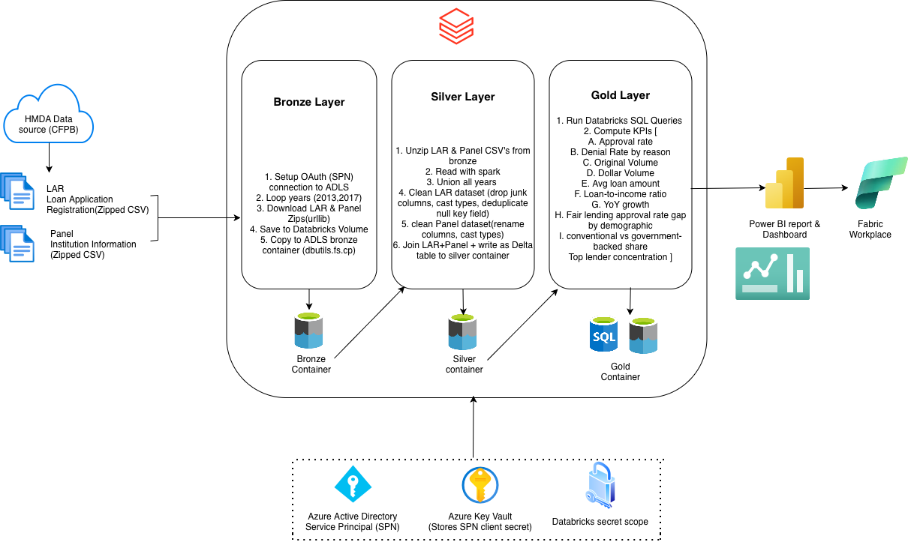

# Mortgage Lending Analytics - Azure Databricks Medallion Pipeline | [Dataset](https://www.consumerfinance.gov/data-research/hmda/historic-data/)

An end-to-end data engineering pipeline that ingests U.S. mortgage lending data (HMDA, 2013–2017), transforms it through a medallion (Bronze → Silver → Gold) architecture on Azure Databricks, and surfaces analytical KPIs including fair-lending approval-rate gaps across demographic groups.

Built with Azure Data Lake Storage Gen2, Azure Databricks, Delta Lake, Unity Catalog, a Service Principal, and Azure Key Vault.

---

## Overview

The Home Mortgage Disclosure Act (HMDA) dataset is one of the most important public datasets on U.S. lending — it exists specifically so regulators and researchers can detect discriminatory lending patterns. This project builds a production-style pipeline over five years of national records (2013–2017), cleans and joins loan-level data with institution-level data, and computes ten KPIs that answer questions about lending volume, approval rates, affordability, market concentration, and lending equity.

## Architecture



Security: a Service Principal authenticates Databricks to ADLS via OAuth; its secret is stored in Azure Key Vault and read through a Databricks secret scope. All resources sit inside a single Azure Resource Group.

## Tech stack

| Layer | Technology |
|---|---|
| Cloud | Microsoft Azure |
| Storage | Azure Data Lake Storage Gen2 (hierarchical namespace) |
| Compute / processing | Azure Databricks, Apache Spark (PySpark) |
| Table format | Delta Lake |
| Governance | Unity Catalog |
| Security | Service Principal (Azure AD) + Azure Key Vault |
| Analytics | Databricks SQL |

## Medallion layers

**Bronze — raw ingestion.**
A parameterized notebook loops over 2013–2017, downloads the LAR (loan records) and Panel (institution records) zip files from the CFPB website, and lands them in the `bronze` container, organized into `lar/` and `panel/` folders. A retry-and-wait mechanism handles transient server failures.

**Silver — cleaned and joined.**
Unzips and reads each year's CSVs, unions all years with `unionByName(allowMissingColumns=True)` to handle schema drift across years, then cleans the data: drops redundant code columns (keeping human-readable label columns), casts types correctly (counts → long, amounts/rates → double, identifiers kept as string), removes duplicates, and drops rows missing key fields. The loan data is joined to the institution data on `respondent_id + agency_code + as_of_year`, and the result is written as a Delta table.

**Gold — analytics and KPIs.**
The Silver Delta table is registered to Unity Catalog and queried with Databricks SQL to produce the project's KPIs and analysis.

## Key performance indicators

1. Loan approval rate
2. Denial rate by reason
3. Total origination volume (by year)
4. Total dollar volume originated
5. Average loan amount (by state)
6. Loan-to-income ratio
7. Fair-lending approval-rate gap across demographic groups
8. Year-over-year origination growth
9. Conventional vs government-backed lending share
10. Top-lender market concentration

> Note on KPI 7: a difference in approval rates across groups is a starting point for investigation, not proof of discrimination on its own — it can reflect differences in income, loan size, or geography. The pipeline includes income and loan-size measures to help contextualize any observed gap.

## Repository structure

```
.
├── README.md
├── notebooks/
│   ├── bronze.ipynb      # ingestion: HMDA source → ADLS bronze
│   ├── silver.ipynb      # transform: clean, union, join → Delta
│   └── gold.ipynb        # analytics: Databricks SQL KPIs
└── architecture.png
```

## Engineering challenges solved

**Source bot-protection.** The CFPB file host blocks programmatic requests from datacenter IP ranges (Akamai). Standard HTTP pulls returned 403 across header tweaks, browser-TLS impersonation, and multiple official mirrors. The working approach was ingesting from a Databricks cluster whose egress IP was not on the block list — verified empirically before building on it.

**Schema drift across years.** HMDA's reporting fields changed over time, so a naive union fails. Using `unionByName` with `allowMissingColumns=True` aligns columns by name and fills gaps, making the multi-year merge robust.

**Secure, production-style access.** Rather than hardcoding storage keys, the pipeline uses a Service Principal with OAuth and stores its secret in Azure Key Vault, surfaced to notebooks through a Databricks secret scope.

## Possible extensions

- Chain the three notebooks into an automated Databricks Workflow (or Azure Data Factory pipeline) with the year range passed as a parameter.
- Add the remaining historical years (2007–2012) to extend the time series.
- Build a dashboard (Databricks SQL dashboard or Power BI) over the Gold KPIs.

## Data source

Home Mortgage Disclosure Act (HMDA) historic data, published by the Consumer Financial Protection Bureau (CFPB).
